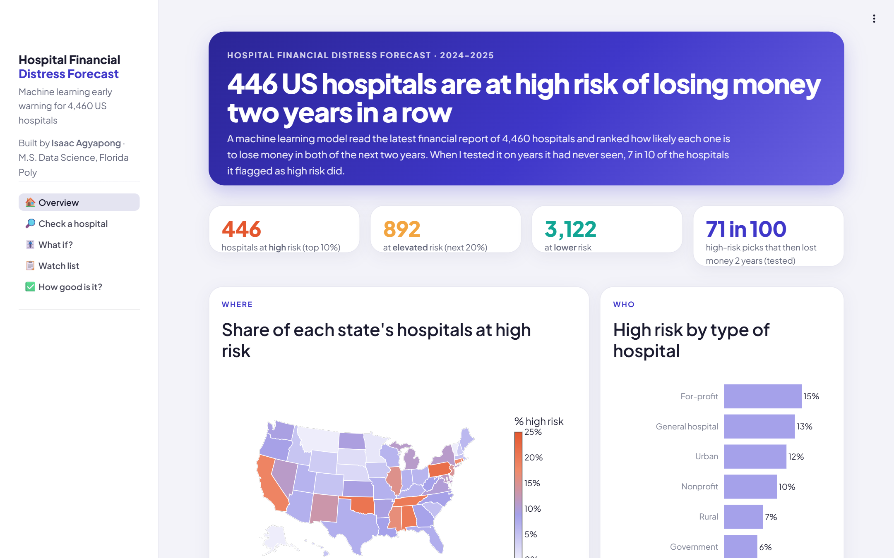
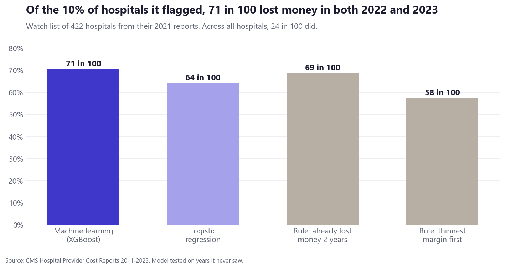
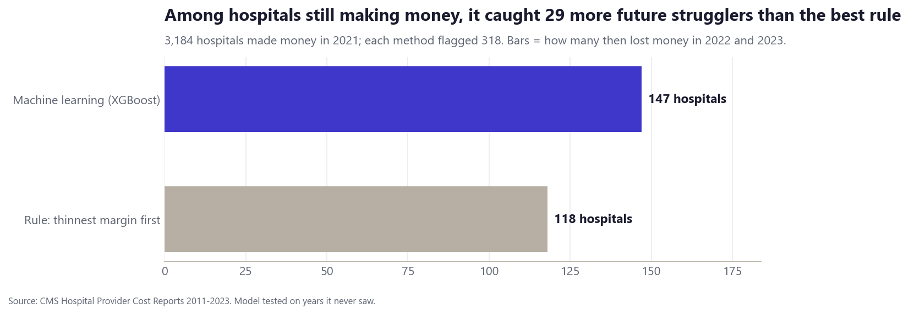
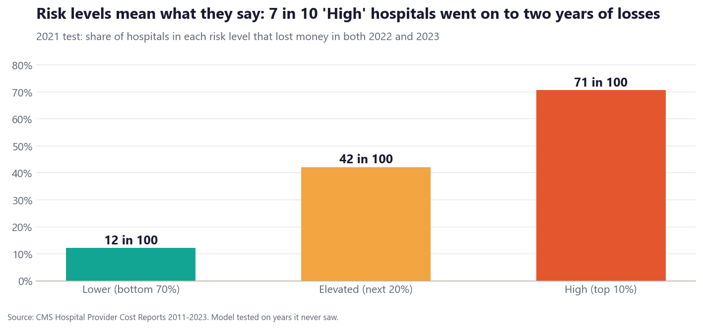
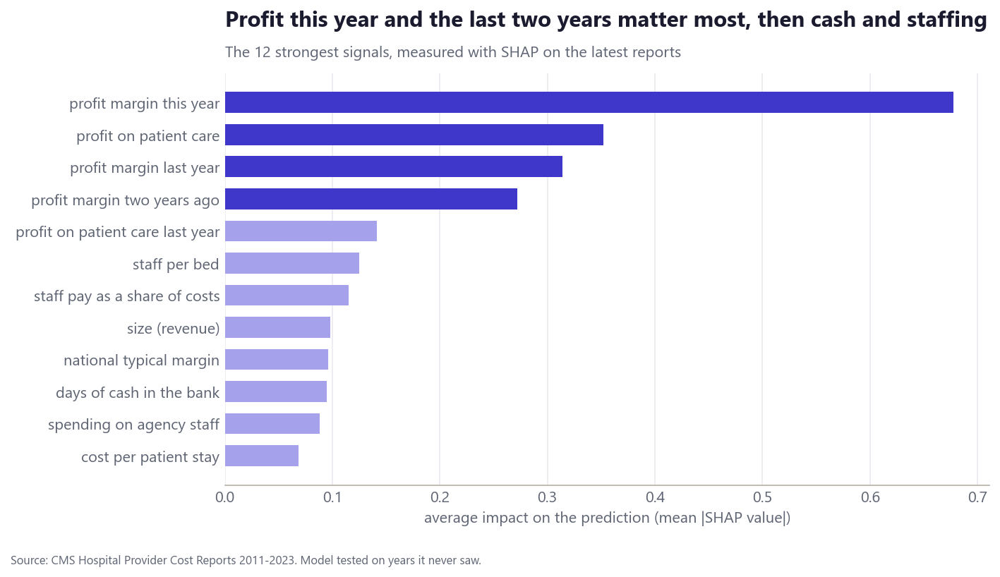
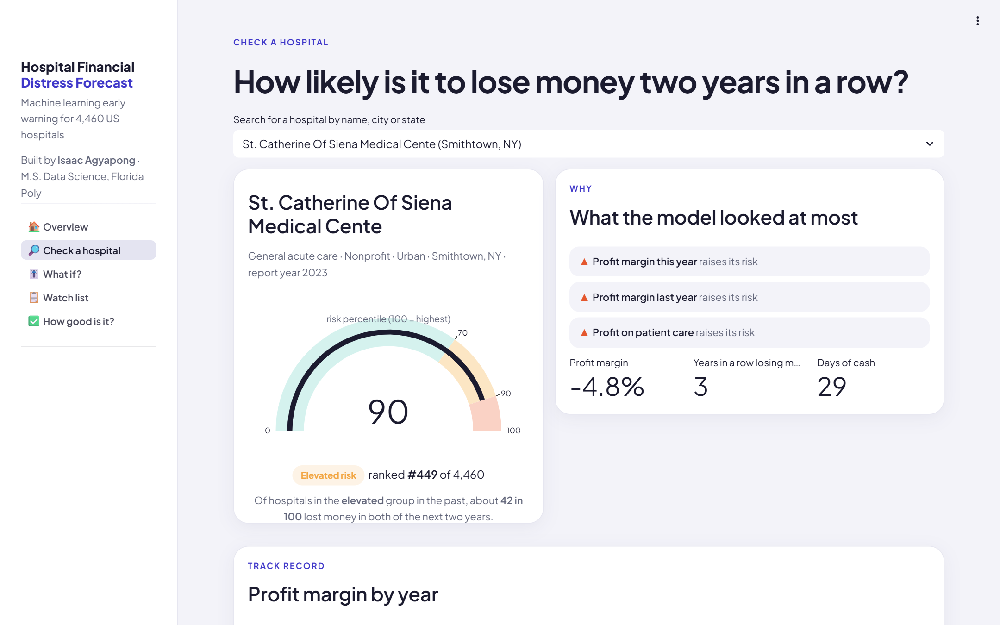
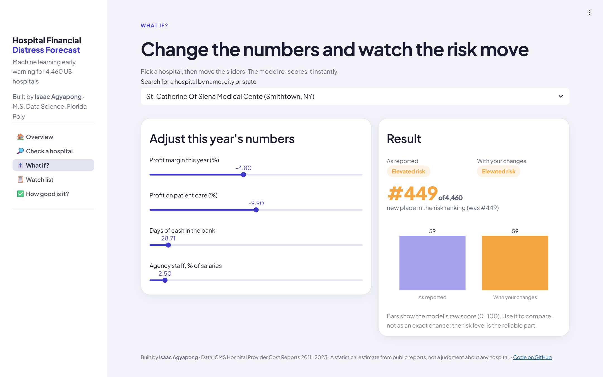

# Machine Learning Model for Hospital Financial Distress Forecasting

**Which US hospitals are likely to lose money two years in a row?** I trained a machine learning model on 13 years of
hospital financial reports to give every hospital an early-warning risk score, and built an app where anyone can look
a hospital up and see why it scored the way it did.

**[▶ Open the live app](#live-app)** · Companion analytics project:
[US Hospital Financial Performance Analysis](https://github.com/Isaac-Agyapong/US_Hospital_Financial_Performance_Analysis)



> ### In short
> - **What it predicts:** from one year's financial report, whether a hospital will **lose money in both of the next
>   two years**. About 1 in 4 US hospitals did in 2022-2023.
> - **How I tested it:** I trained it only on older years and asked it about years it had never seen, the same way it
>   would be used for real.
> - **How well it works:** of the 10% of hospitals it flagged from their 2021 reports, **71 in 100** went on to lose
>   money in both 2022 and 2023. It did better than every rule of thumb I compared it with, in every year I tested.
> - **Its best trick is early warning:** among hospitals that were still making money, it spotted **29 more** of the
>   ones heading into two years of losses than the best simple rule (147 vs 118).
> - **Right now:** based on each hospital's latest report, **446 hospitals** (the top 10%) are at high risk for
>   2024-2025. For-profit city hospitals are most often on the list; small rural "critical access" hospitals, which
>   Medicare pays based on their costs, rarely are.
> - **The app** shows each hospital's risk level, its rank, the top reasons behind the score, and a "What if?" page
>   where you can change its numbers and watch the risk move.

The sections below go into technical detail.

---

## The question and the data

| | |
|---|---|
| **Unit** | one hospital in one year (46,946 hospital-years with a known outcome, 2011-2021) |
| **Target** | lost money (net income below zero) in **both** year *t+1* and year *t+2* |
| **Signals** | 37 facts known at the end of year *t*: profit margin this year and the two before, profit on patient care, years in a row losing money, income from investments and gifts, cash and its change, debt, short-term bills it can cover, cost per stay and its growth, agency staff, staff pay and staff per bed, list prices vs costs, share of Medicare and Medicaid patients, unpaid care, size and growth, hospital type, owner, rural or urban, state Medicaid expansion, and how the state and the country were doing that year |
| **Source** | CMS Hospital Provider Cost Reports 2011-2023, cleaned and checked in PostgreSQL by the [analytics project](https://github.com/Isaac-Agyapong/US_Hospital_Financial_Performance_Analysis) (its margins match MedPAC's published figures within about one point) |

The features and the label are built in SQL ([SQL/01_model_panel.sql](SQL/01_model_panel.sql)) with window functions:
`LAG` for last year's values, `LEAD` for the two-year outcome, gaps-and-islands for loss streaks, and state and national
medians with `percentile_cont`. Only information available at the end of year *t* goes into the features.

## How I tested it

Hospital finances swing with the economy: 10% of hospitals were in distress after 2019, 24% after 2021. So I never
mixed years. A report from year *t* can only be used for training once its outcome is known (*t+2*).

| Step | Trained on report years | Tested on | Outcome years |
|---|---|---|---|
| Choosing settings | up to 2015 / 2016 | 2017 / 2018 | 2018-2020 |
| Backtest | up to 2017 | 2019 | 2020-2021 |
| Backtest | up to 2018 | 2020 | 2021-2022 |
| **Main test** | up to 2019 | **2021** | **2022-2023** |
| Final model | up to 2021 | latest report (mostly 2023) | 2024-2025 |

I compared the model with **logistic regression** and with rules a manager could use without a model:
"already lost money two years in a row" and "thinnest profit margin first". ("Lost money this year" ranks hospitals
exactly like "thinnest margin first", since a loss is a margin below zero.)

## Results

**Share of the flagged 10% that went on to lose money in both of the next two years:**

| Method | 2019 test | 2020 test | 2021 test |
|---|---|---|---|
| **XGBoost (this model)** | **42%** | **54%** | **71%** |
| Rule: already lost money 2 years in a row | 39% | 54% | 69% |
| Logistic regression | 38% | 50% | 64% |
| Rule: thinnest profit margin first | 40% | 50% | 58% |
| *All hospitals (base rate)* | *10%* | *17%* | *24%* |

**Ranking all hospitals (ROC-AUC, 0.5 = guessing, 1.0 = perfect):** XGBoost 0.82 / 0.80 / 0.82, logistic regression
0.81 / 0.78 / 0.81, best rule 0.81 / 0.75 / 0.77.

**Early warning, 2021 test:** 3,184 hospitals made money in 2021, and 16% of them lost money in both 2022 and 2023.
Each method picked 318 of them. The model's picks included 147 future strugglers, against 118 for "thinnest margin
first" (ROC-AUC 0.79 vs 0.69).

| | |
|---|---|
|  |  |

**What a risk level means.** In the 2021 test, of hospitals the model put in each group, this many lost money in both
of the next two years: **High** (top 10%) 71 in 100, **Elevated** (next 20%) 42 in 100, **Lower** 12 in 100.

The raw probabilities run low in the 2021 test (the model learned mostly from calmer years, and 2022 was a very bad
year), so the app shows these **risk levels**, with their track record, rather than an exact percentage.

| | |
|---|---|
|  |  |

**What drives the score** (SHAP): profit this year and in the two years before matter most, then profit on patient
care, staffing, size, cash and agency staff costs. Each hospital's top three reasons are shown in the app.

## Live app

Five pages, built with Streamlit and Plotly:

1. **Overview:** how many hospitals are at high, elevated and lower risk; a US map of the share at high risk; the top 10.
2. **Check a hospital:** search any hospital; see its risk percentile, level, rank, top 3 reasons and profit history.
3. **What if?:** move sliders (profit, profit on patient care, cash, agency staff) and the model re-scores it instantly.
4. **Watch list:** filter by risk level, state, owner and rural or urban; download the list.
5. **How good is it?:** the test results above in plain words.

| | |
|---|---|
|  |  |

Run it locally: `pip install -r app/requirements.txt`, then `streamlit run app/app.py`.

## Skills shown

- **Machine learning:** XGBoost with native categorical features, logistic regression pipeline (imputation, scaling,
  one-hot), time-based backtesting with no look-ahead, tuning on separate validation years, comparison with
  rule-based baselines, precision at top k, ROC-AUC, PR-AUC, calibration check, SHAP explanations per prediction.
- **SQL (PostgreSQL):** feature engineering with window functions (`LAG`, `LEAD`, `row_number` gaps-and-islands),
  `percentile_cont`, CTEs; the label built without leaking future information into features.
- **Python:** pandas, scikit-learn, xgboost, shap, a notebook built with nbformat and executed so outputs show on GitHub.
- **App:** Streamlit multi-page app with custom CSS, Plotly map, gauge and charts, live re-scoring with the saved model.

## Project structure

```
SQL/01_model_panel.sql        features and label, one row per hospital-year (PostgreSQL)
Python/01_build_dataset.py    builds the panel, exports Data/model_panel.csv.gz
Python/02_train_model.py      tuning, backtests, final model, scores and reasons for every hospital
Python/03_build_notebook.py   builds and runs Python/03_model_report.ipynb (results and charts)
models/                       metrics.json, backtest.csv, test predictions, calibration, feature importance
app/app.py                    Streamlit app; app/data/ holds the scores, the model and profit history
run_all.py                    runs the three steps in order
```

## How to reproduce

1. Build the database with the analytics project (`python run_all.py` in
   [US_Hospital_Financial_Performance_Analysis](https://github.com/Isaac-Agyapong/US_Hospital_Financial_Performance_Analysis)).
2. `pip install -r requirements.txt`
3. `python run_all.py` (about 5 minutes).
4. `streamlit run app/app.py`

Without a database, `Data/model_panel.csv.gz` is included, so steps 2 and 3 can start from `Python/02_train_model.py`.

## Limitations

- **Closures are not counted.** A hospital that closes stops filing reports, so it has no outcome and drops out.
  The model predicts money losses among hospitals that keep operating, which likely understates real distress.
- **Scores drift with the economy.** The same numbers mean different risk in a boom and a bust, which is why the app
  uses risk levels and why the model should be retrained each year as new reports arrive.
- **Cost reports are filed by hospitals** and only lightly audited; hospitals in a health system may look weaker or
  stronger on their own than the system really is.
- **A score is a statistical estimate from public data,** not a judgment about how a hospital is run.

---

Built by **Isaac Agyapong** · M.S. Data Science, Florida Polytechnic University · [GitHub](https://github.com/Isaac-Agyapong)
