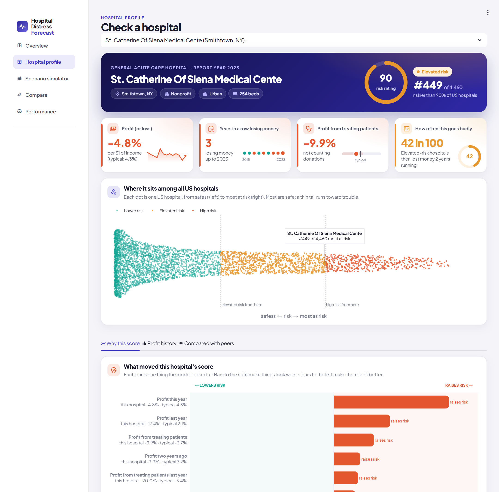
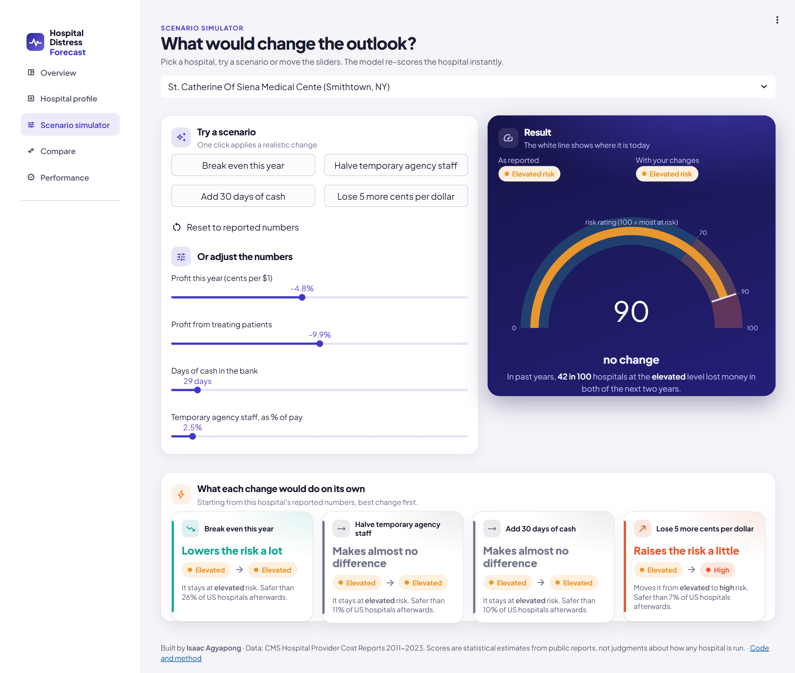
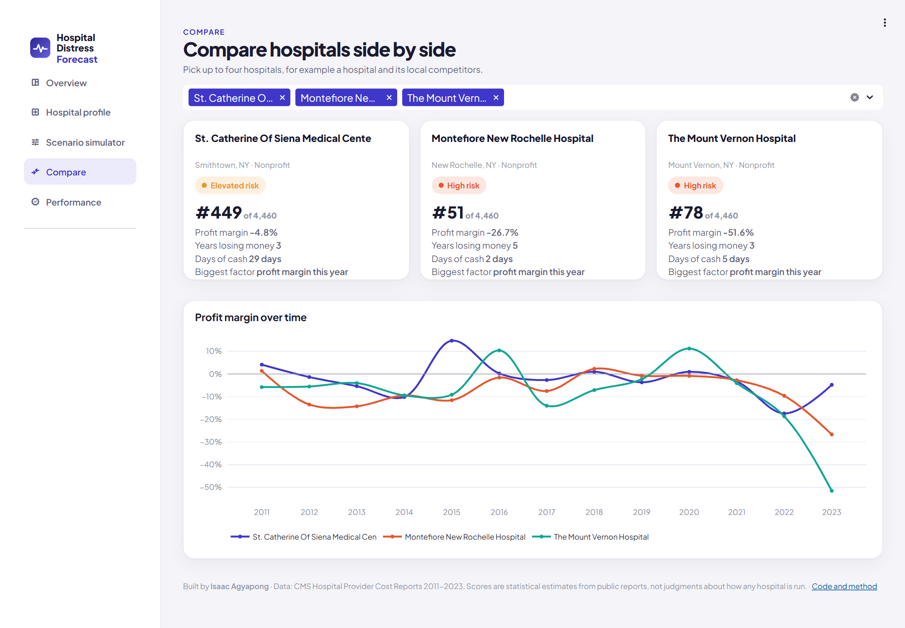
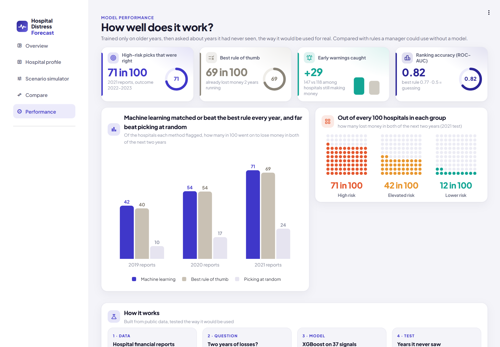

# Machine Learning Model for Hospital Financial Distress Forecasting

**Which US hospitals are likely to lose money two years in a row?** I trained a machine learning model on 13 years of
hospital financial reports to give every hospital an early-warning risk score, and built an app where anyone can look
a hospital up and see why it scored the way it did.

**[▶ Open the live app](https://hospital-risk-forecast.streamlit.app/)** · Companion analytics project:
[US Hospital Financial Performance Analysis](https://github.com/Isaac-Agyapong/US_Hospital_Financial_Performance_Analysis)


> ### In short
> - **What it predicts:** from one year's financial report, whether a hospital will lose money in both of the next
>   two years. About 1 in 4 US hospitals did in 2022-2023.
> - **How I tested it:** I trained it only on older years and asked it about years it had never seen, the same way it
>   would be used for real.
> - **How well it works:** of the 10% of hospitals it flagged from their 2021 reports, **71 in 100** went on to lose
>   money in both 2022 and 2023. It did better than every rule of thumb I compared it with, in every year I tested.
> - **It warns early:** among hospitals that were still making money, it spotted **29 more** of the ones heading into
>   two years of losses than the best simple rule (147 against 118).
> - **Right now:** based on each hospital's latest report, **446 hospitals** (the top 10%) are at high risk for
>   2024-2025. For-profit city hospitals are most often on the list. Small rural hospitals, which Medicare pays based
>   on their costs, rarely are.
> - **The app** lets anyone filter the country, click into any hospital, see what drives its score, try "what if"
>   changes, and compare hospitals side by side.

The rest of this page has the details.

---

## How I tested it

Hospital finances swing with the economy: 10 in 100 hospitals lost money two years running after 2019, and 24 in 100
after 2021. So I never mixed years. The model only learned from years whose outcome was already known, then made
predictions for later years:

| Learned from reports up to | Predicted from reports of | Checked against |
|---|---|---|
| 2017 | 2019 | 2020-2021 |
| 2018 | 2020 | 2021-2022 |
| **2019** | **2021 (main test)** | **2022-2023** |

I compared it with two rules a manager could use without a model: "it already lost money two years in a row" and
"the hospital with the thinnest profit goes first".

## What I found

**Of the 10% of hospitals each method flagged, how many lost money in both of the next two years:**

| Method | 2019 test | 2020 test | 2021 test |
|---|---|---|---|
| **This model** | **42 in 100** | **54 in 100** | **71 in 100** |
| Rule: already lost money 2 years in a row | 39 | 54 | 69 |
| A simpler model (logistic regression) | 38 | 50 | 64 |
| Rule: thinnest profit first | 40 | 50 | 58 |
| *All hospitals* | *10* | *17* | *24* |

**Early warning.** In 2021, 3,184 hospitals made money, and 16 in 100 of them then lost money in both 2022 and 2023.
Each method picked 318 of them. The model's picks included 147 hospitals that went on to struggle, against 118 for the
best rule.

| | |
|---|---|
|  |  |

**What a risk level means.** In the 2021 test, of the hospitals in each group, this many lost money in both of the
next two years: **High** (top 10%) 71 in 100, **Elevated** (next 20%) 42 in 100, **Lower** 12 in 100. The app shows
these levels rather than exact percentages, because exact percentages shift with the economy.

| | |
|---|---|
|  |  |

**What drives the score:** a hospital's profit this year and in the two years before matter most, then its profit on
patient care, staffing, size, cash and spending on temporary agency staff. The app shows each hospital's top three
reasons.

## The app

Five pages, built for people who don't work with data:

1. **Overview:** a map of all 4,460 hospitals as points of light at their real locations (red = high risk; click a
   dot to open the hospital), which kinds of hospitals are most at risk, and a list you can click into. Filters for
   state, hospital type, owner, and rural or urban change every number and chart.
2. **Hospital profile:** its risk level and rank, where it sits among all hospitals, the main reasons for its score,
   its profit history and a comparison with similar hospitals.
3. **What if:** one-click changes ("break even this year", "cut agency staff in half", "add 30 days of cash") or
   sliders; the score updates straight away.
4. **Compare:** up to four hospitals side by side.
5. **Performance:** the test results above.

| | |
|---|---|
|  |  |
|  |  |

## Limits

- **Hospitals that close aren't counted.** A hospital that closes stops filing reports, so it drops out. The model
  predicts losses among hospitals that keep running, which likely understates real trouble.
- **Scores move with the economy,** so the model should be retrained every year as new reports arrive.
- **Hospitals fill in these reports themselves,** and they are only lightly checked. Hospitals in a health system
  may look weaker or stronger on their own than the system really is.
- **A score is an estimate from public data,** not a judgment about how a hospital is run.

## Technical details

For readers who want the specifics:

- **Data:** CMS Hospital Provider Cost Reports 2011-2023, cleaned in PostgreSQL by the
  [analytics project](https://github.com/Isaac-Agyapong/US_Hospital_Financial_Performance_Analysis) (its margins match
  MedPAC's published figures within about one point). 46,946 hospital-years with a known outcome, 2011-2021.
- **Target:** net income below zero in both year t+1 and year t+2.
- **Features (37, all known at the end of year t):** profit margin this year and the two before, operating margin,
  loss streak, non-operating income share, days of cash and its change, debt ratio, current ratio, cost per discharge
  and its growth, contract labour, salary share, staff per bed, charge-to-cost ratio, Medicare and Medicaid day
  shares, uncompensated care, size and growth, hospital type, owner, rural or urban, Medicaid expansion, and state
  and national medians that year. Built in SQL ([SQL/01_model_panel.sql](SQL/01_model_panel.sql)) with `LAG`,
  `LEAD`, gaps-and-islands loss streaks and `percentile_cont`.
- **Model:** XGBoost with native categorical features; settings tuned on validation years 2017 and 2018. Compared with
  logistic regression (imputation, scaling, one-hot) and the two rules.
- **Scores:** precision in the top 10%; ROC-AUC 0.82 / 0.80 / 0.82 for XGBoost against 0.81 / 0.75 / 0.77 for the best
  rule; early-warning ROC-AUC 0.79 against 0.69. Raw probabilities run low in the 2021 test (2022 was an unusually bad
  year), hence the risk levels.
- **Explanations:** SHAP values per hospital; the app re-scores scenarios live from the saved model (`pred_contribs`).
- **App:** Streamlit and Plotly, custom CSS, map and table click-through, session-state scenarios.

```
SQL/01_model_panel.sql        features and outcome, one row per hospital-year
Python/01_build_dataset.py    builds the panel, exports Data/model_panel.csv.gz
Python/02_train_model.py      tuning, backtests, final model, scores and reasons for every hospital
Python/03_build_notebook.py   builds and runs Python/03_model_report.ipynb
Python/04_hospital_locations.py  places each hospital at its ZIP code centre for the map
models/                       metrics, backtests, test predictions, feature importance
app/app.py                    Streamlit app; app/data/ holds the scores, model and profit history
run_all.py                    runs everything in order
```

**To run it yourself:** build the database with the analytics project, then `pip install -r requirements.txt`,
`python run_all.py` (about 5 minutes) and `streamlit run app/app.py`. `Data/model_panel.csv.gz` is included, so
training can start from `Python/02_train_model.py` without a database.

---

Built by **Isaac Agyapong** · [GitHub](https://github.com/Isaac-Agyapong)
